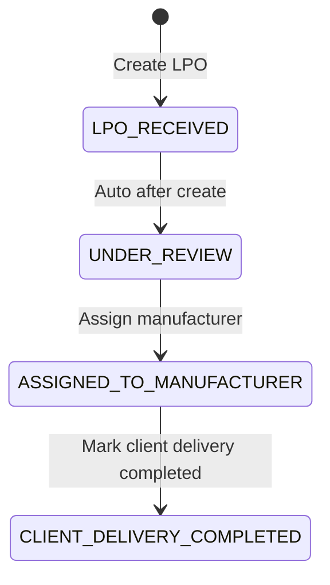
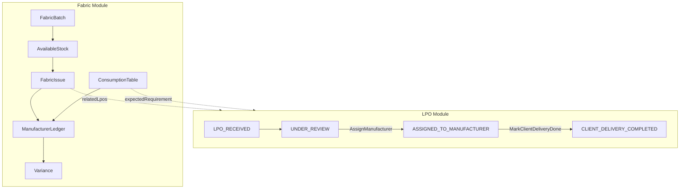
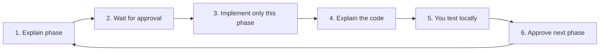

# Ditanik — LPO + Fabric Greenfield Rewrite

## Principle

**Enterprise-ready = how the software is designed**, not how much infrastructure you rent.

Modular monolith on free tiers (Vercel + Neon + Auth.js + Resend later). One Next.js app with strict internal boundaries. Rebuild product domain for the new flows; keep proven shell pieces.

```text
Cheap infrastructure  +  Clear domain boundaries  =  This plan
```

---

## Breaking change (read this)

The previous product (Pending → Reviewed → Delivered, simple fabric entries, invoices-by-vendor, old overdue email types) is **obsolete**.

Phase 1 will **replace the Prisma schema** for LPO/Fabric. Expect a **dev database reset** (`prisma migrate reset` or drop + redeploy). Do not assume old rows migrate. Production wipe is intentional until a real migration path is needed.

**Keep (infrastructure):**

- Google allowlist auth (`auth.ts`, `middleware.ts`)
- App shell + responsive nav patterns
- PDF upload rules + local file storage adapter + `DocumentViewer`
- Neon/Prisma/Zod/Vitest patterns
- Neon connect retry + “database waking up” error UI

**Remove / replace (product):**

- Old LPO status machine and review-PDF gate
- Old due-date fields tied to review/delivery of previous model
- Old fabric entry + invoices-by-vendor as the primary model
- Old overdue notification types tied to previous dates

---

## Locked decisions

| Concern | Choice |
| ------- | ------ |
| Architecture | Modular monolith (domain → application → actions → UI) |
| Runtime | Next.js App Router + Server Actions + Route Handlers |
| DB | Postgres (Neon) + Prisma migrations |
| Contracts | Zod at every server boundary |
| Auth | Auth.js + Google; allowlist; role `ADMIN` |
| Files | PDF-only; private storage; shared in-app viewer |
| Timezone | UTC storage; browser-local display; business EOD **Asia/Dubai** |
| LPO status | **Hybrid** (confirmed) — see below |
| Date extensions | Assignment + production deadline: **reason required**. Client delivery: **reason optional** |
| Fabric history | Append-only movements (bank statement). No silent edits/deletes |
| UI library | Tailwind only |
| Delivery | Approval-gated phases — explain → wait → build → teach → test |

### LPO status (hybrid)



| Status | How it happens |
| ------ | -------------- |
| `LPO_RECEIVED` | On create (brief; immediately followed by auto transition) |
| `UNDER_REVIEW` | **Automatic** after create — 2-day internal review timer; no “start review” button |
| `ASSIGNED_TO_MANUFACTURER` | Manual **Assign Manufacturer** (manufacturer + production PDF) |
| `CLIENT_DELIVERY_COMPLETED` | Manual **Mark Client Delivery Completed** |

Dashboard may show **Production Deadline** as phase copy / date emphasis while status is `ASSIGNED_TO_MANUFACTURER` (not a separate DB status in v1).

### LPO date defaults

| Date | Default |
| ---- | ------- |
| Manufacturer assignment date | Received date + **2** days |
| Manufacturer production deadline | Received date + **12** days |
| Client delivery date | Received date + **15** days |

Remaining 3 days (12→15) reserved for trial fitting, corrections, final handover.

---

## Product modules

| Module | Responsibility |
| ------ | -------------- |
| **LPO** | Client orders, review timer, manufacturer assignment, dual deadlines, dashboard |
| **Manufacturers** | Registry (create or select when assigning) |
| **Fabric Inventory** | Batches, stock, issues, returns — append-only movements |
| **Manufacturer Fabric Ledger** | Sent vs expected used vs expected/reported balance |
| **Consumption** | Garment → meters table; LPO expected = qty × rate |
| **Variance** | Expected vs actual + reason enum |

**Nav (target):** LPO | Fabric | Manufacturers | Consumption

Fabric is **independent** of LPO for stock movements, but can **link** to LPOs (issues, expected requirement, variance).

---

## LPO Management flow

1. **LPO received** — number, nickname, client, LPO date, received date, LPO PDF → status Received → auto Under Review.
2. **Internal review (2 days)** — prepare production file, measurements, verify details. Assignment date default = received + 2. Extend with **new date + mandatory reason**.
3. **Assign manufacturer** — existing or register new; production file PDF; status → Assigned.
4. **Delivery dates** — production deadline (received + 12), client delivery (received + 15); extend production with mandatory reason; extend client delivery with optional reason.
5. **Dashboard columns** — LPO #, Nickname, Client, Received, Manufacturer, Production Due, Client Delivery (+ status).

---

## Fabric Management flow (independent)

1. **Purchase / receive** — supplier invoice + **multiple fabric batches** on one invoice; system fabric ID; type; colour; remarks; qty meters.
2. **Stock** — derived from movements (opening available = received).
3. **Issue to manufacturer** — batch, manufacturer, date, qty, transport/ref, related LPO(s); stock decreases.
4. **Link to LPO** — expected fabric from garment lines × consumption rates.
5. **Manufacturer fabric account** — previous balance + sent − expected used = leftover; additional fabric required for new LPO.
6. **Consumption table** — standard garment meters (e.g. Chef Jacket 1.8m).
7. **Variance** — expected vs actual; reasons: cutting wastage, damage, size alteration, production mistake, other.
8. **Manufacturer fabric dashboard** — received / expected used / expected balance / reported balance / difference.
9. **Never delete movements** — corrections via new reversing/adjustment entries.



---

## Data model (direction for Phase 1)

**Keep/adapt:** `User`, `Role`, `AuditLog`

**LPO / manufacturers:**

- `Manufacturer`
- `Lpo` — number, nickname, client, dates, files, status, manufacturerId?, production file, completedAt?
- `LpoDateChange` — field `ASSIGNMENT` | `PRODUCTION_DEADLINE` | `CLIENT_DELIVERY`, old/new, reason (nullable for client delivery only)
- `LpoFabricRequirement` / line — garment, qty, rate snapshot, expected meters

**Fabric:**

- `FabricSupplierInvoice` — supplier, ref, date, optional PDF
- `FabricBatch` — system fabric id, type, colour, remarks, invoice, qty received
- `FabricMovement` — append-only: `RECEIVED` | `ISSUED` | `USED_FOR_LPO` | `RETURNED` | `ADJUSTMENT`
- `GarmentConsumptionRate`
- `FabricVariance`

Movements are the **source of truth** for stock and ledger math.

---

## Architecture layers (non-negotiable)

1. **Pages/components** — UI only
2. **Server Actions / Route Handlers** — Zod parse, call one service, map errors
3. **Application services** — orchestration, transactions, authz, audit
4. **Domain** — pure functions (status, dates, meters, variance)
5. **Adapters** — Prisma, file storage, email

---

## Delivery process (mandatory)



### Coding standards

- `Readonly<{ ... }>` props
- Short rare comments
- Clear names; small diffs; layers respected
- Responsive Tailwind (`sm` / `md` / `lg`)
- No Material/Ant/etc. unless blocked

---

## Phase plan

| Phase | What we build | What you test |
| ----- | ------------- | ------------- |
| **0** | This ROADMAP + README; greenfield reset documented | Docs match the new product |
| **1** | New schema/migration; domain + unit tests; start retiring old domain | Tests pass; migrate/reset works |
| **2** | Manufacturers + LPO create/list/detail (assign, dates, PDFs, complete delivery) | Full LPO happy path in UI |
| **3** | Fabric invoice + multi-batch, stock, issue, append-only ledger | Stock math + issue flow |
| **4** | Consumption, LPO expected fabric, manufacturer dashboard, variance | Ledger + variance scenarios |
| **5** | Dead-code cleanup, audits, optional deadline emails, polish, CI prep | Clean app; deploy checklist |

**Current position: Phases 0–5 complete.** Product rewrite delivered; use CI + deploy checklist for production.

---

## FE layout direction

- **LPO list** — operational table (columns above) + status chip → detail
- **LPO detail** — summary → dates/extensions → assignment → fabric requirement (Phase 4) → documents
- **Fabric** — Batches / Stock / Issues as separate views or tabs
- **Manufacturer** — profile + fabric ledger (Phase 4)
- No single mega-dashboard; modules stay separate

---

## Phase 1 non-goals (until you ask)

- Multi-role permissions beyond Admin
- Cloud blob/S3 (keep local `uploads/` for now)
- Visual design-system overhaul
- New overdue email redesign (optional in Phase 5)
- Migrating old production data

---

## Cursor build brief

> Rebuild Ditanik for the new LPO Management Dashboard (hybrid statuses, +2/+12/+15 dates, manufacturer assignment, production file) and independent Fabric Management (batches, append-only movements, manufacturer ledger, consumption, variance). Phase 0 docs done. Implement **one approved phase at a time**. Before each phase: explain scope and wait. After each phase: teach what changed, then wait for local testing before continuing.
