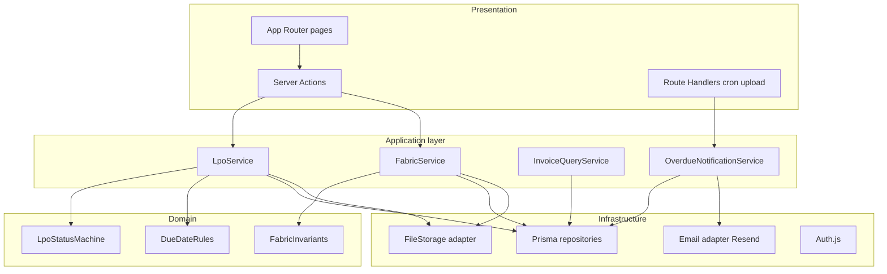
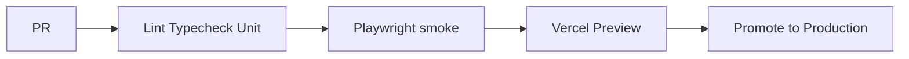
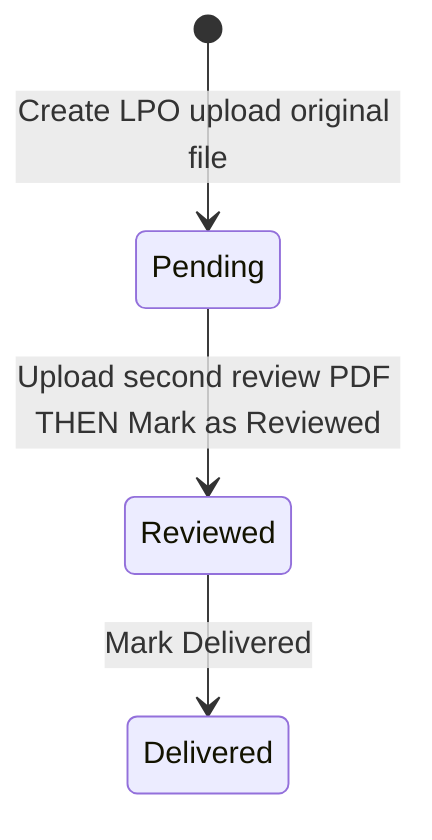
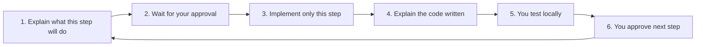

# Ditanik Platform — Enterprise Architecture, Minimal Cost

## Principle

**Enterprise-ready = how the software is designed**, not how much AWS you rent.

We use a **modular monolith** (what many high-scale orgs ship first): one deployable Next.js app with **strict internal boundaries**, production security, auditability, CI, and a clean path to split services later — hosted on **free tiers** so cost stays ~$0 while you learn.

```text
Cheap infrastructure  +  Top-tier code architecture  =  This plan
Expensive AWS         +  Messy spaghetti             ≠  Enterprise
```

---

## Locked decisions

| Concern            | Choice                                                                                                                                             |
| ------------------ | -------------------------------------------------------------------------------------------------------------------------------------------------- |
| Architecture style | **Modular monolith** (domain modules, layered services)                                                                                            |
| Runtime            | **Next.js 15** App Router — UI + Server Actions + Route Handlers                                                                                   |
| Cost               | **~$0/mo** free tiers (Vercel + Neon + UploadThing/Blob + Resend)                                                                                  |
| DB                 | **Postgres (Neon)** + **Prisma** migrations                                                                                                        |
| Contracts          | **Zod** shared schemas — single source of truth FE/BE                                                                                              |
| Auth               | **Auth.js + Google**; allowlist; role `ADMIN` (enum ready for more roles)                                                                          |
| Jobs               | **Vercel Cron** + idempotent notification records                                                                                                  |
| Email              | **Resend**                                                                                                                                         |
| Files              | Blob/UploadThing; private URLs; MIME/size allowlist                                                                                                |
| Document viewing   | **Shared in-app PDF viewer for every upload** (LPO original, review PDF, fabric invoices, Invoices module); Download always available              |
| Upload format      | **PDF required** for all document fields so every stored file is viewable in-app                                                                   |
| Timezone           | UTC storage; browser-local display; business EOD **Asia/Dubai**                                                                                    |
| Quality            | Strict TS, ESLint, Husky, Vitest, Playwright, GitHub Actions                                                                                       |
| Responsive UI      | **Required on every screen**. Use normal Tailwind responsive classes (`sm:` / `md:` / `lg:`) in shared layouts — no custom breakpoint config file. |
| Deferred infra     | Nest/ECS/Terraform until free tier or team scale requires it                                                                                       |

---

## Enterprise architecture (inside one app)



### Layer rules (non-negotiable)

1. **Pages/components** — UI only; no Prisma, no business if/else for status
2. **Server Actions / Route Handlers** — parse input (Zod), call one service, map errors to UI
3. **Services** — orchestration, transactions, authz checks, audit writes
4. **Domain** — pure functions (status transitions, due-date math, remaining meters)
5. **Repositories / adapters** — Prisma, Blob, Resend; swappable later (S3, SES, Nest)

This is the same layering Nest uses — without Nest ceremony.

---

## Production folder structure

```text
ditanik/
  app/                          # presentation only
    (auth)/login/
    (app)/
      lpo/                      # routes + thin UI
      fabric/
      invoices/
    api/
      auth/[...nextauth]/
      cron/overdue/             # CRON_SECRET guarded
      files/                    # signed URL helpers if needed
  modules/                      # enterprise feature modules
    lpo/
      domain/                   # status machine, due-date rules
      application/              # LpoService
      infrastructure/           # lpo.repository.ts
      schemas.ts                # Zod
    fabric/
    invoice/
    notification/
    files/
    identity/                   # user, allowlist, roles
  components/                   # shared UI (shadcn)
  lib/
    db.ts                       # Prisma singleton
    auth.ts
    errors.ts                   # AppError, Result mapping
    dates.ts                    # UTC + Asia/Dubai
    logger.ts                   # structured JSON logs
  prisma/
    schema.prisma
    migrations/
  tests/
    unit/                       # domain + services
    e2e/                        # Playwright critical flows
  .github/workflows/ci.yml
```

---

## Enterprise quality bar

### Security

- Google SSO + email allowlist; session httpOnly cookies
- Every mutation: authenticated + Admin check
- Zod validation on **every** server boundary
- File MIME allowlist + max size; no public bucket listing
- Cron route: `Authorization: Bearer CRON_SECRET`
- Security headers (Next config / middleware)
- No secrets in repo; Vercel env per Preview/Production

### Reliability & data

- Prisma migrations only (no manual prod SQL)
- DB constraints: unique `lpoNumber`, `metersDelivered <= metersReceived`, status enum
- Status transitions only via domain state machine → `409` on illegal moves
- Audit log on status + due-date changes
- Email idempotency table (one REVIEW_OVERDUE / DELIVERY_OVERDUE per LPO until due extended)
- Transactions for multi-step writes (e.g. mark reviewed)

### Observability

- Structured logging (`requestId`, `userId`, `action`)
- Friendly UI errors; detailed logs server-side
- Vercel + Neon dashboards; optional Sentry free tier later

### CI/CD (GitHub free + Vercel)



- Husky pre-commit: lint-staged
- `prisma migrate deploy` on release
- Preview deployments for every PR

### Testing focus

- **Unit:** status machine, due-date EOD Dubai → UTC, fabric remaining
- **Integration:** LpoService with test DB (or Prisma mock for thin cases)
- **E2E smoke:** login gate, create LPO, mark reviewed path (as feasible with test auth)

---

## Product scope (unchanged)

Sidebar: **LPO** | **Fabric Inventory** | **Invoices**

### LPO status machine



### Mark as Reviewed — hard gate (two files, two steps)

An LPO always has **two different documents** by the time it is Reviewed:

| Document              | When                                                 | Purpose                                                                   |
| --------------------- | ---------------------------------------------------- | ------------------------------------------------------------------------- |
| **Original LPO file** | At **Create LPO**                                    | The LPO received from vendor (**PDF**, required)                          |
| **Review PDF**        | While status is **Pending**, before marking reviewed | Separate PDF proving/completing review — **not** the same as the original |

**Rules (enforced in domain + UI):**

1. Uploading the original at create does **not** count as the review document.
2. User must upload a **new PDF** on the LPO detail page (review attachment).
3. **Mark as Reviewed** stays **disabled** until that review PDF is stored.
4. Only after the review PDF exists can the user click **Mark as Reviewed** → status becomes `REVIEWED`.
5. Calling mark-reviewed without `reviewFileKey` → `400` / domain error (never trust the UI alone).

```mermaid
sequenceDiagram
  participant U as Admin
  participant UI as LPO detail
  participant Svc as LpoService

  Note over U,Svc: Status PENDING; original file already exists
  U->>UI: Upload review PDF only
  UI->>Svc: attachReviewFile
  Svc->>Svc: Store reviewFile; status stays PENDING
  Note over UI: Mark as Reviewed becomes enabled
  U->>UI: Click Mark as Reviewed
  UI->>Svc: markReviewed
  alt No review PDF
    Svc-->>UI: Reject
  else Review PDF present
    Svc->>Svc: status REVIEWED
  end
```

### Core flows (summary)

| Flow              | Rules                                                                                                                                                         |
| ----------------- | ------------------------------------------------------------------------------------------------------------------------------------------------------------- |
| Create LPO        | Number, received date ≤ today, **original** file, review days default **2**, delivery days default **15** → Pending                                           |
| Comments          | One-way chat; show local date/time                                                                                                                            |
| Attach review PDF | Separate PDF while Pending; required before Mark as Reviewed                                                                                                  |
| Mark Reviewed     | **Only if** review PDF uploaded; then explicit button; original file alone is not enough                                                                      |
| Mark Delivered    | Button only from Reviewed                                                                                                                                     |
| Change due dates  | Justification required (min length); audit row                                                                                                                |
| Overdue email     | Daily cron; Pending past review due; not Delivered past delivery due                                                                                          |
| Fabric create     | Vendor, color, meters in/out, destination, **required invoice**; remaining = in − out                                                                         |
| Invoices          | Group by normalized vendor; **open each invoice in the same in-app PDF viewer** + download                                                                    |
| Documents         | **Universal `DocumentViewer`**: LPO original, review PDF, fabric invoices, and Invoices section — every uploaded PDF opens in-app; Download on every document |

Full sequence diagrams from prior plan still apply; implementation uses **services** instead of Nest controllers.

---

## Data model (Prisma)

- `User` — role enum (`ADMIN` now; extensible)
- `Lpo` — files, dueAts, status, review file, timestamps
- `LpoComment` — append-only
- `LpoDueDateChange` — justification history
- `FabricEntry` — inventory + invoice
- `EmailNotification` — idempotency
- `AuditLog` — entity, action, actor, payload JSON

---

## Cost vs architecture

| Layer                      | Choice                             | Enterprise?                                      |
| -------------------------- | ---------------------------------- | ------------------------------------------------ |
| Code structure             | Modular monolith + domain services | Yes — standard at scale                          |
| Validation / typing        | Zod + strict TS                    | Yes                                              |
| Auth / audit / CI          | Auth.js, AuditLog, GitHub Actions  | Yes                                              |
| Hosting                    | Vercel + Neon free                 | Good for internal Admin app; upgrade when needed |
| Message bus / multi-region | Not yet                            | Add when traffic/compliance demands              |

**Upgrade path without rewrite:** swap `FileStorage` → S3/R2, `Email` → SES, extract `modules/lpo` → Nest microservice, move Neon → RDS. Boundaries already exist.

---

## What you learn (FE → full-stack enterprise)

- Domain vs UI separation (how big products stay maintainable)
- Server Actions as an API boundary
- Prisma + migrations
- Authz, audit trails, idempotent jobs
- CI quality gates

Still no AWS console or Nest required for v1.

---

## Delivery process (mandatory — step by step)

We will **not** build the whole website in one go. Work follows this loop for **every** step:



### Before each step (assistant must)

- State **step number + title**
- List **exact files** that will be created/changed
- Say **what you will be able to test** after the step
- **Stop and wait** for your explicit approval (e.g. “go”, “approved”, “do step N”)

### After each step (assistant must)

- Summarize what changed in plain language
- **FE-dev summary (required):** brief list of actions taken + what each important file does, explained for a frontend developer
- Point out **naming** when useful
- Tell you **how to run/test** (commands + clicks)
- **Do not start the next step** until you approve

### Coding standards (every step)

- **Readonly props**: wrap component props with `Readonly<{ ... }>` (same pattern as Next.js root layout)
- **Comments**: short and rare — one brief line for a util or non-obvious rule; no long tutorials in code
- **Clear names**: `createLpo`, `markLpoAsReviewed`, `calculateMetersRemaining` — names carry meaning so comments stay minimal
- **Small diffs**: only what the current step needs
- **Layers respected**: UI does not talk to Prisma directly when a service exists
- Prefer readable code over clever code (you are learning BE as we go)
- **Responsive by default**: use Tailwind responsive classes in shared layouts/components; no separate breakpoint config
- **No UI-library churn**: stay on **Tailwind** only — do not add Material, Ant, or similar unless we hit a hard limit
- **DRY layout**: one app shell / page container / form stack reused by LPO, Fabric, Invoices — pages only supply content, not duplicate responsive chrome

Example props style:

```ts
export function PageContainer({
  title,
  children,
}: Readonly<{
  title: string;
  children?: React.ReactNode;
}>) { ... }
```

---

## Step-by-step build plan (small slices)

| Step   | What we build                                                      | What you test                               |
| ------ | ------------------------------------------------------------------ | ------------------------------------------- |
| **1**  | Next.js app, TS strict, folder skeleton, lint/format               | `pnpm dev` loads empty app                  |
| **2**  | Responsive shell: desktop sidebar + mobile/tablet drawer + 3 pages | Nav works on phone, tablet, laptop, desktop |
| **3**  | Prisma + DB connection + `User` model                              | Migration runs; DB connected                |
| **4**  | Google Auth + allowlist + route protection                         | Login works; non-allowlisted blocked        |
| **5**  | LPO-related Prisma models only                                     | Schema/migration OK; no full UI yet         |
| **6**  | LPO domain logic + unit tests (no UI)                              | Tests pass for status/due dates             |
| **7**  | Create LPO form + action (upload may be stub)                      | Submit form creates Pending LPO             |
| **8**  | Real PDF upload to storage                                         | File stored; PDF-only enforced              |
| **9**  | Shared `DocumentViewer` + Download                                 | Open original LPO PDF in-app                |
| **10** | LPO list + detail                                                  | Browse LPOs; see status/dates               |
| **11** | Comments thread                                                    | Add comments; see date/time                 |
| **12** | Review PDF upload + Mark as Reviewed                               | Button disabled until PDF; then Reviewed    |
| **13** | Mark as Delivered                                                  | Reviewed → Delivered                        |
| **14** | Due date change + justification                                    | Cannot change without reason; history shows |
| **15** | Cron + Resend overdue emails                                       | Dry-run/cron secret; email or log           |
| **16** | Fabric create + remaining meters                                   | Create fabric; remaining correct            |
| **17** | Fabric invoice + viewer                                            | View fabric invoice PDF                     |
| **18** | Invoices by vendor                                                 | Vendor list + view each invoice             |
| **19** | CI + deploy checklist                                              | Push triggers CI; prod notes                |

Current position: **Step 1 complete.** Responsive baseline locked for all future UI. Next: Step 2 after your approval.

---

## Implementation order

Replaced by the **Step-by-step build plan** above. Do not batch multiple steps unless you explicitly ask.

---

## Universal document viewing

One shared component: `components/documents/DocumentViewer.tsx` (PDF.js).

Used everywhere a file exists:

| Surface              | Document                       | View in-app | Download |
| -------------------- | ------------------------------ | ----------- | -------- |
| LPO detail           | Original LPO PDF               | Yes         | Yes      |
| LPO detail           | Review PDF                     | Yes         | Yes      |
| Fabric detail / row  | Fabric invoice PDF             | Yes         | Yes      |
| Invoices (by vendor) | Each invoice under that vendor | Yes         | Yes      |

**UX:** “View” opens a modal/drawer with the PDF; “Download” always available beside it. Authz: only signed-in Admin; URLs short-lived / private.

**Upload rule:** all document inputs accept **`application/pdf` only** (max size e.g. 25MB) so every stored file can be viewed. No Word-only uploads in phase 1.

---

## Phase 1 non-goals

- Multi-service Nest/ECS
- Paying for AWS
- Multi-tenant SaaS
- Word/DOCX upload (PDF-only so all docs are viewable)
- Roles beyond Admin (schema ready)

---

## Cursor build brief

> Build Ditanik as an enterprise modular monolith in Next.js 15, **one small approved step at a time** (see Step 1–19). Before each step: explain scope and wait for approval. After each step: explain the code (purpose of files, naming, business rules), with teaching comments in code, then wait for the user to test before continuing. Product rules unchanged: LPO dual-PDF review gate, comments, due dates + justification, fabric remaining + invoice PDF, invoices-by-vendor, universal PDF DocumentViewer, free-tier infra, layered modules.
